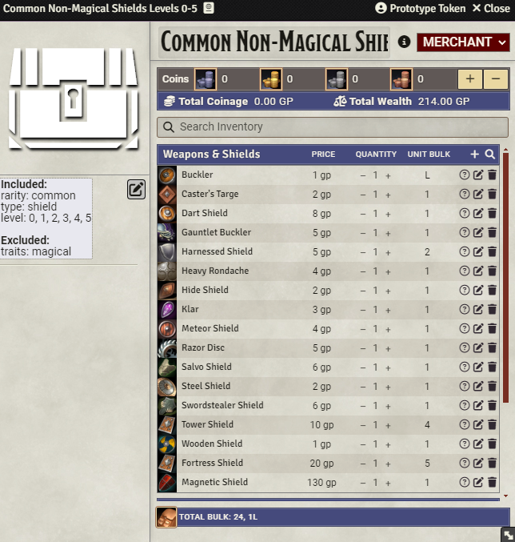

# PF2E Merchant Maker

This FoundryVTT module allows for the quick creation of merchants for the Pathfinder 2nd Edition system.

## Overview

Adds a button to the bottom of the Actors Tab.


The button opens a window form with include and exclude criteria. The criteria comes from the equipment compendium from the Pathfinder 2nd Edition FoundryVTT system.


## Installation

For now, use this link in the install module field in FoundryVTT.
```
https://github.com/HavocsCall/foundryvtt-pf2e-merchant-maker/releases/latest/download/module.json
```
I will submit this to be added to Foundry's Module list if there is interest.

## How to Use

Fill out the form with the name, include, and exclude criteria, press "Make me a Merchant" and profit.

The merchant is created into your actors ready for selling.



The items are sorted by Rarity > Level > Name.

## Settings

- Add Criteria Summary - If enabled, this will add a small summary of the criteria used to generate this merchant as a "GM Text Block".


- Close on Submit - If enabled, when you click "Make me a Merchant", it will either close the form. Otherwise, it will not close each time you make a new merchant. This is mostly used for if you want to make a lot of merchants at once, you want to leave this off.

- Module Item Piles Setup - If enabled and you have the module, [Item Piles: PF2E](https://github.com/mechamaya/itempiles-pf2e), this will set up the merchant with my preferred base settings. This includes marking them as a Merchant, setting the quantity to infinite, setting the range to infinite, and setting the level column.

## FAQ

- All criteria values are pulled from the PF2E Equipment compendium. This means that all values are literal. One example is Throwing weapons; in the system, they do not have a range, so they are considered melee weapons that have the thrown trait.
- Values in each individual criteria is treated as an `OR`. Across criteria, it is treated as an `AND`. Example: if you select multiple categories and multiple traits, the logic would be `(Category1 OR Category2) AND (Trait1 OR Trait2 OR Trait3)`.

## Found a Bug or Have a Suggestion?

Feel fee to create an issue on [Github](https://github.com/HavocsCall/foundryvtt-pf2e-merchant-maker/issues). Thanks for helping make this better.

## Future Plans

- Add a specific "Melee" and "Ranged" option for weapons.
- Make the window prettier.
- Add an option for value ranges, like levels 0-5 instead of "0, 1, 2, 3, 4, 5". I'm not positive about this since there is the possibility that someone may want non-consecutive levels. That would require both the range and the selectable. That might get confusing.

## AI Disclaimer

I did use AI to help with some specific things. I did not have AI inject code directly, just talked to it for "rubberducking" and syntax issues. If this puts you off, I completely understand.
